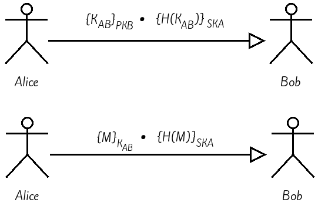

# Implémentation d'un protocole d’échange sécurise avec OpenSSL

## Introduction

Nous allons dans ce rapport procéder a l’implémentation d'un protocole d’échange sécurisé hybride qui garantie les services de sécurité suivant:

+ Confidentialité de l’échange .
+ Intégrité des données échangées .
+ Non répudiation de l’émetteur.

Pour cela nous allons essayer de mettre en œuvre le système dont la conception a été précédemment établie: 




## Implémentation

En ce qui concerne cette partie, nous allons la découper en 3 phases:

#### Phase 1: Création des couples de clés

Dans cette phase chaqu’un des deux protagonistes va créer leur propre paire de clés une clé publique et une clé prive (`PKi` et `SKi`)

##### 1. Script de création des couples de clés

```bash
#!/bin/bash

# Demander de l'utilisateur de tapper le mot de passe
read -sp 'Entrez le mot de pass: ' mypass

# Generation d'une cle prive pour RSA (skA.pem) puis la crypter en utilisant l'algorithme DES et le mot de passe 'mypasswd'
openssl genrsa -out skA.pem -passout pass:$mypass -des 512

# Genration de la cle publique (pkA.pem) associée a la cle prive (skA.pem)
openssl rsa -in skA.pem -passin pass:$mypass -out pkA.pem -pubout
```

###### Résultats obtenus:

1. Création de deux fichiers skA.pem et pkA.pem dans le répertoire courant (de Alice)

On Ré-exécute le script dans le répertoire de Bob en changeant skA.pem et pkA.pem par skB.pem et pkB.pem respectivement.

###### Remarque:

+ Chaqu'un peut publier sa clé publique dans le canal non-sécurise. (copier le fichier pkX.pem)

------------------

#### Phase 2: Échange de la clé de session

Dans l'ouverture de la session Alice va générer aléatoirement une clé de session qui va être communiqué a Bob, cette clé sera cryptée en utilisant la clé publique de Bob, la signature sera garantie dans ce transfert (c'est le role du cryptage asymétrique dans ce système hybride)

##### 1. Script de génération et cryptage de clé de session

```bash
#!/bin/bash

# Generation d'une cle random de 64 octes puis l'enregistrer dans le fichier kAB
openssl rand 16 > kAB

# Cryptage du fichier kAB avec la cle publique de Bob 
openssl rsautl -in kAB -out kAB.crypt -inkey pkB.pem -pubin -encrypt

# Hachage de la cle kAB par MD5 et ecrire le resultat en mode binaire
openssl dgst -md5 -binary -out kAB.md5 kAB

# Signature du haché de kAB par le prive key de Alice
openssl rsautl -in kAB.md5 -out kAB.md5.sign -sign -inkey skA.pem

# Suppression du kAB.md5 (fichier temporaire)
rm -f kAB.md5
```

###### Résultats obtenus:

1. Création d'un fichier kAB contenant la clé de session.
2. Création d'un fichier kAB.crypte contenant le cryptogramme de kAB.
3. Création d'une fichier kAB.md5.sign contenant la signature de hache de la clé de session.

###### Remarque:

Les deux fichiers (kAB.crypte et kAB.md5.sign) vont être envoyés a Bob puis supprimes du répertoire de Alice


##### 2. Script de décryptage et vérification de la non-répudiation et l'intégrité de la clé de session

```bash
#!/bin/bash

# Decryptage du fichier recu kAB.crypt par la cle prive (skB.pem) 
openssl rsautl -decrypt -in kAB.crypt -out kAB -inkey skB.pem

# Hachage du kAB par MD5
openssl dgst -md5 -binary -out kAB1.md5 kAB

# Verification de la signature des fichiers recu en utilisant la cle publique d'Alice 
openssl rsautl -in kAB.md5.sign -out kAB2.md5 -pubin -inkey pkA.pem

# Comparaison du resultat de Hache de kAB recu et de Hache de kAB envoye
var1=$(cat kAB1.md5)
var2=$(cat kAB2.md5)
if [ "$var1" == "$var2" ]
	then
		# Suppression des fichier temporaire
		rm -f kAB.crypt kAB1.md5 kAB.md5.sign kAB2.md5
		echo "La cle a ete correctement transmis."
		# Afficher le message 'Press any key to exit' et attendre un caractère
		read -n 1 -s -r -p "Press any key to exit"
		exit 0 # Exit avec code de succes
	else 
		# Suppression des fichier temporaire
		rm -f kAB.crypt kAB1.md5 kAB.md5.sign kAB2.md5
		echo "Attention, la cle a ete modifie."
		# Afficher le message 'Press any key to exit' et attendre un caractère
		read -n 1 -s -r -p "Press any key to exit"
		exit 1 # Exit avec code d'echec
fi
```

###### Résultats obtenus:  

1. Création d'un fichier kAB contenant la clé de session envoyé par Alice 
2. affichage d'une message de sucée ('La clé a été correctement transmis.') dans le cas ou la transmission est correct (la clé de session reçu est la mémé que celle envoyé). Ou l'affichage d'un message d’échec ('Attention, la clé a été modifie.') dans le cas ou le fichier envoyé et le fichier reçu sont différents.

------------------

#### Phase 3: Échange des messages

Après l’établissement des deux phases précédentes il est maintenant possible d'envoyer des messages entre 
Alice et Bob en utilisant le cryptage symétrique pour assurer la confidentialité et le cryptage par clé prive pour la signature

##### 1. Script de cryptage des messages

```bash
#!/bin/bash

# Chiffrement du message (Message.txt) avec la cle symetrique (kAB)
openssl enc -des-cbc -in Message.txt -out Message.crypt -pass file:kAB

# Hachage du message (Message.txt) par l'algorithme MD5
openssl dgst -md5 -binary -out Message.md5 Message.txt

# Signature du hache du message avec la cle prive de Alice
openssl rsautl -in Message.md5 -out Message.md5.sign -sign -inkey skA.pem

# Suppression des fichiers intermediaires
rm -f Message.md5
```

###### Résultats obtenus:

1. Création du fichier Message.crypte contenant le message crypté avec la clef de session kAB.
2. Création du fichier Message.md5.sign contenant la signature du hache de message

###### Remarque:

Les deux fichiers (Message.crypte et Message.md5.sign) vont être envoyés a Bob puis supprimes du répertoire de Alice


##### 2. Script de décryptage des messages 

```bash
#!/bin/bash

# Decryptage du fichier recu Message.crypt par la cle du session kAB en utilisant l'algorithm DES et la stratégie CBC
openssl enc -in Message.crypt -out Message.txt -pass file:kAB -d -des-cbc

# Verification de la signature des fichiers recu en utilisant la cle publique d'Alice
openssl rsautl -in Message.md5.sign -out Msg1.md5 -pubin -inkey pkA.pem

# Verification de la signature des fichiers recu en utilisant la cle publique d'Alice 
openssl dgst -md5 -binary -out Msg2.md5 Message.txt

# Comparaison du resultat de Hache de kAB recu et de Hache de kAB envoye
var1=$(cat Msg1.md5)
var2=$(cat Msg2.md5)
if [ "$var1" == "$var2" ]
	then
		# Suppression des fichier temporaire
		rm -f Message.crypt Msg1.md5 Message.md5.sign Msg2.md5
		echo "Le message est transmi avec succe. Vous pouvez le consuler dans Message.txt"
		# Afficher le message 'Press any key to exit' et attendre un caractère
		read -n 1 -s -r -p "Press any key to exit"
		exit 0 # Exit avec code de succes
	else 
		# Suppression des fichier temporaire
		rm -f Message.crypt Msg1.md5 Message.md5.sign Msg2.md5
		echo "Echec du transmission du message (Le message a ete modiffier)."
		# Afficher le message 'Press any key to exit' et attendre un caractère
		read -n 1 -s -r -p "Press any key to exit"
		exit 1 # Exit avec code d'echec
fi
```

###### Résultats obtenus:

1. Création du fichier Message.txt contenant le message reçu d'Alice.
2. affichage d'une message de sucée ('Le message est transmis avec sucée. Vous pouvez le consulter dans Message.txt') dans le cas ou la transmission est correct (le message reçu est le même que le message envoyé). Ou l'affichage d'un message d’échec ('Échec du transmission du message (Le message a été modifié).') dans le cas ou le message envoyé et le message reçu sont différents.

###### Remarque:

Bob peut maintenant lire le message envoyé par Alice.
